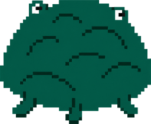

<p align="center">
  
</p>

# COG Viewer

**Live:** [cog-viewer.pages.dev](https://cog-viewer.pages.dev)

A small, no-build, browser-based viewer and analyzer for **Cloud Optimized
GeoTIFFs**. Drop a URL or a local `.tif` in, draw a region, see what's there —
then copy a Python snippet to keep going in Jupyter.

## What it's for

You've got a COG and want to know, quickly:

- Is it actually cloud-optimized? (Internal tiles? Overviews? Where are they?)
- What's the CRS, the value range, the NoData convention?
- What does the data look like in *this* region — and what does the histogram
  tell me about it?
- How do I pull the same window into Python to do real analysis?

This tool answers all of those in a single page, without standing up a
Jupyter kernel, downloading the whole file, or writing rasterio boilerplate
twice.

It's built around the principle that a COG viewer should be **COG-aware**:
fetch only the bytes the current view actually needs. See
[How it stays COG-aware](#how-it-stays-cog-aware) for the algorithm.

## Quick start

```bash
git clone <this repo>
cd cog-viewer
./dev.sh
```

`dev.sh` binds to `0.0.0.0`, so other devices on the same Wi-Fi can hit the
printed LAN URL. Install `qrencode` (`sudo apt install qrencode`) to also get
a QR for mobile testing.

If you'd rather skip the wrapper:

```bash
python3 -m http.server 5503 --bind 0.0.0.0
```

Then open `http://localhost:5503`.

### Try it on a real COG

Copernicus DEM 30 m, Mt. Fuji area:

```
https://copernicus-dem-30m.s3.eu-central-1.amazonaws.com/Copernicus_DSM_COG_10_N35_00_E138_00_DEM/Copernicus_DSM_COG_10_N35_00_E138_00_DEM.tif
```

(That URL has CORS enabled and works from the browser. Many public datasets
on AWS Open Data and Planetary Computer follow the same pattern.)

## Features

**Three-step flow** — Add data → Select & fetch → Analyze. Each step's card
unlocks as the previous one completes.

- **Map preview with proper overview selection.** Downloads only the bytes
  the screen actually needs. The network panel shows cumulative bytes, request
  count, and which overview level was picked.
- **Stats + histogram** for any selected sub-region.
- **Multi-band / RGB compose** auto-detected from `SamplesPerPixel`. Pick any
  band for single-band view, any 3 for RGB.
- **Color palettes** — elevation, terrain, viridis, magma, cividis, grayscale,
  RdBu_r (diverging, useful for diff layers).
- **Stretch** — auto (min/max), percentile 2-98, or manual.
- **Inspect panel** — IFD ladder per overview, full TIFF tags, GeoKeys, plus a
  COG-friendliness badge that flags non-tiled or non-overview files.
- **Map tools** — pixel-value hover, elevation profile (draw a polyline,
  double-click to finish), and clip-and-download a sub-GeoTIFF with the CRS
  and geotransform preserved.
- **Copy as Python** — generates a `rasterio` or `rioxarray` snippet that
  reproduces the current view (same URL, bbox, overview level), ready to
  paste into a Jupyter cell.
- **Drag-drop** — drop a local `.tif` anywhere on the page to load it
  offline.
- **Permalink** — the URL hash carries dataset URL, bbox, output size,
  palette, stretch, and band selection. Refresh-restores; copy to share.
- **Japanese plane-rectangular CRSes** (EPSG:6669–6687) pre-registered.

## How it stays COG-aware

Most generic GeoTIFF viewers download the whole file. This one doesn't:

1. **Header probe.** `GeoTIFF.fromUrl` sends a bounded `Range: 0-16383`
   request, which is enough to parse the IFD chain at the front of the file.
2. **Coarsest-overview selection.** `groundRes = max(bbox / outputPx)`; pick
   the coarsest overview level whose resolution still satisfies that.
   Wasting bytes on finer-than-screen data is the most common COG-viewer
   failure mode — `selectOverview()` in `js/cog/overview.js` exists to avoid
   it.
3. **Tile-aligned Range requests.** `readRasters({ window })` issues one
   Range request per tile that intersects the requested window.

If you select a huge bbox at 256×256 output and the network panel shows
overview "level 0 / 5" (full resolution), something is wrong with the
algorithm. Open an issue.

### NoData

Round outliers in Min/Max (`-9999`, `-32768`, `1.7e38`) almost always mean a
sentinel slipped through. The viewer checks, in order:

1. Declared `GDAL_NODATA` tag.
2. Float sentinels: `NaN`, `±Infinity`, `±1e30` (Japanese DEMs use `1.7e38`).
3. Integer sentinels: `-9999`, `±32768`.

The Inspect panel shows the declared NoData (if any). Files with exotic
sentinels (`-999`, `9999`, `255`) need a declared tag — and not all files set
one.

## Tech

- Pure HTML + ES modules. **No build step, no `npm install`.**
- [OpenLayers 10](https://openlayers.org/) for the map
- [geotiff.js](https://github.com/geotiffjs/geotiff.js) for COG parsing + Range
  requests
- [proj4js](http://proj4js.org/) for non-standard CRSes

Loaded from CDN — `git clone` and run.

## Module layout

```
js/
  state.js          - state singleton + tiny pub/sub bus
  crs.js            - Japanese plane-rectangular CRS registration
  net.js            - fetch counter + network-bar rendering
  cog/
    load.js         - URL or Blob → header
    overview.js     - selectOverview, window math
    nodata.js       - sentinel detection
    ifd.js          - IFD/tag/GeoKey extraction
    readers.js      - fetch single-band / RGB
  render/
    palette.js      - color ramps
    stretch.js      - auto / p2-98 / manual
    single.js       - single-band paint
    rgb.js          - RGB compose
  map/
    setup.js        - map + vector sources
    draw.js         - bbox selection
    tools.js        - info / profile / clip switcher
    profile.js      - profile chart
    clip.js         - clip + GeoTIFF write
  panels/
    datasource.js, selection.js, analysis.js,
    bandcontrols.js, ifdinspector.js, codegen.js
  util/
    permalink.js    - URL-hash encode/decode
    dragdrop.js     - file drop zone
  main.js           - bootstrap
```

## Deploy

Static site. Push anywhere — GitHub Pages, Cloudflare Pages, Netlify,
S3+CloudFront. With Wrangler:

```bash
npx wrangler pages deploy . --project-name=cog-viewer
```

## Origins

Started as an internal tool for testing COGs served from
[Re:Earth Serve](https://github.com/reearth). The original prototype is a
single-file ~850-line HTML; credit to its accompanying README for the war
stories about overview geotransforms, NoData edge cases, and the
Float32 + WebGLTile trap (clamps to 0–255, gives you a blank image).

## License

MIT — see [LICENSE](LICENSE).
